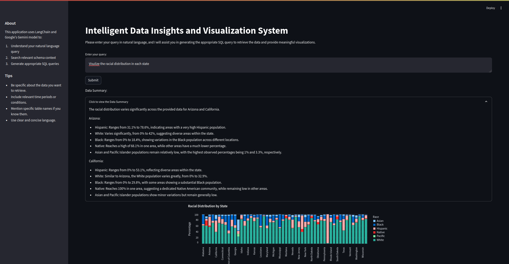

# 📊 Intelligent Data Insights and Visualization System

Welcome to the **Intelligent Data Insights and Visualization System**, an AI-powered web application that enables users to generate SQL queries from natural language input and visualize the results effectively.

## 🚀 Project Overview

This system leverages **LangChain** and **Google's Gemini AI** to:

1. **Understand Natural Language Queries** – Convert user input into meaningful SQL queries.
2. **Search Relevant Schema Context** – Find the best-matching database schema.
3. **Generate Accurate SQL Queries** – Provide optimized SQL queries for execution.
4. **Visualize Results** – Present data in a user-friendly and insightful manner.

---

## Dataset
- The U.S. Census data utilized for this bot has been sourced from Kaggle. The dataset can be accessed via the link [US Census Data on Kaggle](https://www.kaggle.com/datasets/muonneutrino/us-census-demographic-data?select=acs2017_census_tract_data.csv)

- This dataset provides comprehensive demographic insights, enabling the bot to generate meaningful responses based on user queries related to population statistics, socio-economic trends, and other key demographic indicators.

---

## ⚙️ Features

- **Natural Language to SQL Translation**  
  Generate SQL queries effortlessly based on plain English input.

- **Real-time Data Visualization**  
  View results using interactive charts and tables.

- **Fallback Handling**  
  Intelligent fallback mechanism to provide meaningful responses when queries cannot be generated.

- **User-Friendly Interface**  
  Clean and responsive UI with a mobile-first approach.

---

## 🏗️ Tech Stack

- **WebApp:** Streamlit  
- **AI Model:** LangChain + Google's Gemini  
- **Database:** Google BigQuery  
- **Infrastructure:** Docker, GCP  

---

## 🛠️ Installation Guide

Follow the steps below to set up the project locally:

### 1. Clone the Repository

```bash
git clone https://github.com/your-username/intelligent-data-insights.git
cd intelligent-data-insights
```

### 2. Create a Virtual Environment
```
python3 -m venv venv
source venv/bin/activate  # On Windows use `venv\Scripts\activate`
```

### 3. Install Dependencies
```
pip install -r requirements.txt
```

### 4. Set Up Environment Variables
Create a .env file and configure the following:
- GCP_PROJECT_ID=
- BIGQUERY_CREDENTIALS_PATH=

### 5. Run the Application
```
streamlit run app.py
```

# 🏛️ Project Flow Diagram


# 📊 Usage Guide

- Enter a natural language query, e.g., "Show me the total sales for Q1 2024."

- Submit the query to generate an SQL statement.

- View results as an interactive table and chart.


